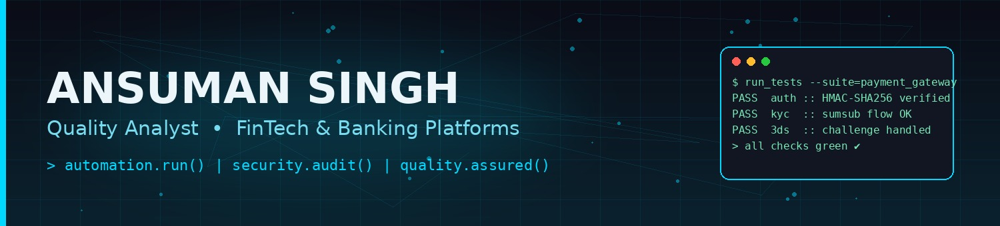
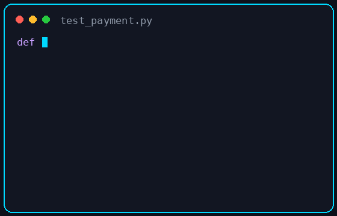

<div align="center">



<br/>


<br/><br/>

<a href="mailto:qa.ansuman@gmail.com"></a>
<a href="https://www.linkedin.com/in/ansumansingh"></a>
<a href="https://github.com/Ansuman0"></a>
<a href="https://leetcode.com/Ansuman0"></a>
<a href="https://www.codechef.com/users/Ansuman0"></a>
<a href="https://www.geeksforgeeks.org/user/Ansuman0"></a>
<a href="https://www.hackerrank.com/Ansuman0"></a>

<br/><br/>

<a href="resume.pdf">
  
</a>

<br/>


</div>

<br/>


## 🧠 About Me

<table>
<tr>
<td width="60%" valign="top">

I'm a **Quality Analyst** with 4+ years of experience engineering quality into high-stakes **FinTech and banking platforms** — payment gateways, KYC/KYB/AML pipelines, card issuance systems, and crypto-to-fiat rails.

- 🔍 I design and build **API test automation frameworks** in Python, Java, and TypeScript
- 🛡️ I run **security audits** on financial applications — IDOR, race conditions, idempotency, rate limiting, SSO
- ⚡ I load-test systems with **Locust** to validate performance under real-world concurrency
- 🤖 I'm exploring **AI agent-based test automation** with Playwright
- 🌱 Currently deep-diving into **AWS, MCP servers, and RAG-powered Quality Analysis tooling**
- 💬 Ask me about payment gateway testing, test framework architecture, or quality analysis process design

</td>
<td width="40%" align="center">

</td>
</tr>
</table>


## 🏆 Competitive Programming

<div align="center">


</div>

<table align="center">
<tr>
<th>Platform</th>
<th>Profile</th>
<th>Focus Area</th>
</tr>
<tr>
<td>💛 LeetCode</td>
<td><a href="https://leetcode.com/Ansuman0">Ansuman0</a></td>
<td>Data Structures & Algorithms</td>
</tr>
<tr>
<td>🟤 CodeChef</td>
<td><a href="https://www.codechef.com/users/Ansuman0">Ansuman0</a></td>
<td>Contest Problem Solving</td>
</tr>
<tr>
<td>🟢 GeeksforGeeks</td>
<td><a href="https://www.geeksforgeeks.org/user/Ansuman0">Ansuman0</a></td>
<td>Core CS Concepts</td>
</tr>
<tr>
<td>💚 HackerRank</td>
<td><a href="https://www.hackerrank.com/Ansuman0">Ansuman0</a></td>
<td>SQL & Problem Solving</td>
</tr>
</table>

> Update the usernames/links above to match your actual competitive programming profiles.


## 🛠️ Skills & Tech Stack

<div align="center">

**Languages**
<br/>


**Automation & Testing**
<br/>


**API & Documentation**
<br/>


**Cloud & DevOps**
<br/>


**Reporting & Log Analysis**
<br/>


</div>

<br/>

<table>
<tr><th>Category</th><th>Skills</th></tr>
<tr><td><b>Testing Disciplines</b></td><td>Manual, Functional, Regression, Smoke, Sanity, Integration, End-to-End, Cross-Browser, Mobile, API, Security, Performance/Load</td></tr>
<tr><td><b>FinTech Domain</b></td><td>Payment Gateway Lifecycle, KYC/KYB/AML, 3DS, Card Issuance, Crypto-to-Fiat, PCI-DSS</td></tr>
<tr><td><b>Security Testing</b></td><td>IDOR, Race Conditions, Idempotency, Rate Limiting, Single Sign-On (SSO), HMAC Signing, GDPR Data Retention</td></tr>
<tr><td><b>Automation</b></td><td>Selenium WebDriver, Playwright (Java/TypeScript/Python), TestNG, pytest, POM, Data-Driven Frameworks, AI Agent-Based Automation</td></tr>
<tr><td><b>Cloud & Infrastructure</b></td><td>AWS (EC2, VPC, boto3), Azure Functions, Azure DevOps</td></tr>
<tr><td><b>CI/CD & Tooling</b></td><td>Jenkins, GitHub Actions, Azure DevOps Pipelines, Git/GitHub</td></tr>
</table>


## 🚀 Projects

<table>
<tr><th>Project</th><th>Description</th></tr>
<tr><td>🔹 <b>API Test Automation Suite</b></td><td>Python + Playwright + pytest framework with Allure reporting — HMAC-SHA256 auth, KYC/KYB, card issuance flows</td></tr>
<tr><td>🔹 <b>FinTech Security Audit</b></td><td>Structured security audit uncovering IDOR, race conditions, and audit-log integrity risks in a crypto-fiat payment platform</td></tr>
<tr><td>🔹 <b>Multi-Stack Automation Frameworks</b></td><td>Hybrid frameworks in Java + Selenium, Playwright + Java, Playwright + TypeScript with POM, parallel execution, dual reporting</td></tr>
<tr><td>🔹 <b>AI Agent-Based Test Automation</b></td><td>Exploratory agent-driven testing using AI with TypeScript + Playwright and Python + Playwright</td></tr>
<tr><td>🔹 <b>Load & Performance Testing</b></td><td>Locust + Python suites validating API throughput and stability under concurrent load</td></tr>
<tr><td>🔹 <b>AWS Infrastructure Provisioning</b></td><td>Two-VPC AWS architecture with EC2 provisioning automated via boto3</td></tr>
<tr><td>🔹 <b>Quality Analysis Support Tooling</b></td><td>Flask-based multi-organization support dashboard with SLA tracking</td></tr>
</table>


## 💼 Experience

```text
Quality Analyst                                                      4+ Years
FinTech & Banking Platforms — Payment Gateways · Card Issuance · Crypto-to-Fiat

├── Designed and built API test automation frameworks (Python, Java, TypeScript)
├── Led security audits identifying critical go-live blockers on payment platforms
├── Automated cloud infrastructure provisioning (AWS boto3, Azure Functions)
├── Authored Quality Analysis documentation, RTMs, and Knowledge Transfer trackers across teams
└── Built performance test suites using Locust to validate system reliability
```


## 🏅 Achievements

<table>
<tr><td>🎯</td><td>Delivered end-to-end automation frameworks across 4+ tech stacks</td></tr>
<tr><td>🛡️</td><td>Identified critical security vulnerabilities across multiple FinTech platform audits</td></tr>
<tr><td>📊</td><td>Built reusable Quality Analysis documentation systems adopted across 5+ projects</td></tr>
<tr><td>☁️</td><td>Automated multi-VPC cloud infrastructure for Quality Analysis environments</td></tr>
</table>


## 📊 GitHub Analytics

<p align="center"><i>Statistics reflect public repositories only.</i></p>

<div align="center">


<br/>


<br/>


<br/>


</div>

> **Known issue:** The Top Languages and Trophy widgets above run on the free shared `vercel.app` instance, which is frequently rate-limited and can show a broken placeholder for extended periods (not just brief refreshes) — this has been the case across multiple checks. The Stats and Streak cards tend to be more reliable. If these keep breaking, the permanent fix is to deploy your own free copy on Vercel: [github-readme-stats](https://github.com/anuraghazra/github-readme-stats#deploy-on-your-own) and [github-profile-trophy](https://github.com/ryo-ma/github-profile-trophy#deploy-your-own-instance), then swap the image URLs above to point at your own deployment. Alternatively, remove the Top Languages/Trophy lines entirely and keep only the Stats, Streak, and Activity Graph widgets, which have shown more consistent uptime.


## 🌐 Open Source

<div align="center">

</div>

<br/>

> 📌 Pin your key repositories via **GitHub → Customize your pins** so they surface directly on your profile. Recommended: API Test Automation Suite, Multi-Stack Automation Frameworks, AWS Infrastructure Provisioning, Locust Load Testing.

Contributions and PRs to testing/automation tooling repositories are welcome — feel free to open an issue or reach out before submitting a large change.


## 📬 Contact

<div align="center">

<a href="mailto:qa.ansuman@gmail.com"></a>
<a href="https://www.linkedin.com/in/ansumansingh"></a>
<a href="resume.pdf"></a>

<br/><br/>

<i>Thanks for stopping by — always open to conversations about quality analysis strategy, test automation architecture, or FinTech security.</i>

</div>


